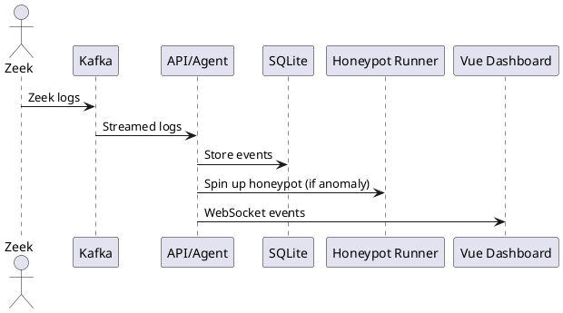

# Sentinel-Swarm Pro

## Objective
Ingest live Zeek logs, detect anomalies, and spin-up a disposable Docker honeypot so autonomous agents can verify or contain the threat.

## Tech Stack / Steps
- Python + FastAPI
- single-node Kafka
- LangGraph agent loop
- sqlite
- Tiny-ViT on packet-payload hex

### Pipeline
1. Stream logs → Kafka  
2. IsolationForest clusters anomalies  
3. Agent chooses log / quarantine / honeypot  
4. Vue dashboard.

## Challenges
- Streaming back-pressure
- Safe container execution
- Tuning anomaly thresholds

## Why It Wows
Blends multi-agent RL, cybersecurity, and lightweight orchestration—skills hot with 2025 security teams.

---

## Quick Start

```sh
make dev
```

## Architecture



## Screenshots

*TODO: Add screenshots here*
